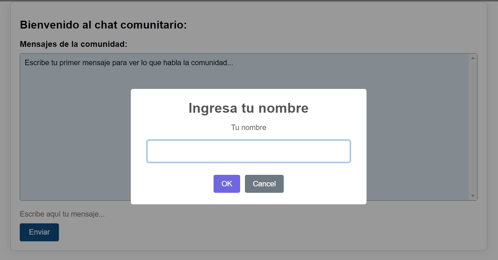
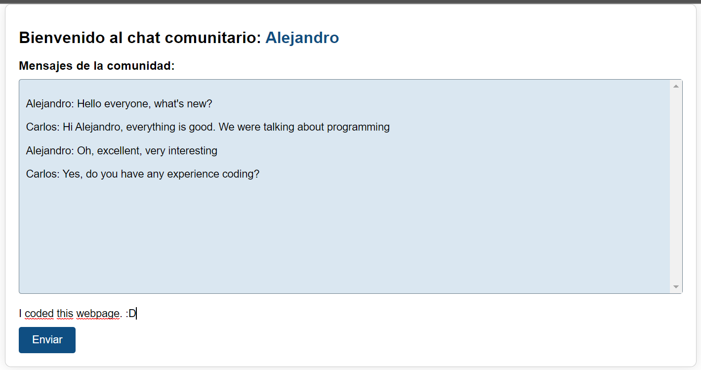
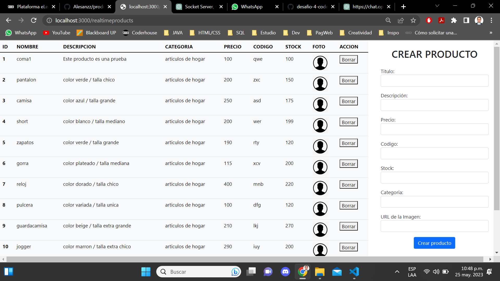

<h1 align="center">
SOCKET SERVER
</h1> 

<p align="justify">A socket server is a software component that allows network communication between multiple clients and a server using the socket programming interface. The main features of a socket server typically include:

- Socket Creation: It creates a socket to listen for client connections.
- Connection Handling: It accepts and manages incoming client connections.
- Multithreading or Asynchronous Operations: It handles multiple client connections concurrently.
- Request Processing: It processes client requests according to the defined protocol or application logic.
- Data Serialization/Deserialization: It converts structured data for transmission over the network.
- Event Handling: It responds to events such as data arrival or client disconnection.
- Security: It ensures secure communication through encryption, authentication, and access control.
- Scalability: It handles a large number of client connections and distributes load if needed.
- Error Handling: It handles errors and provides appropriate responses to clients.
- Logging and Monitoring: It logs server activity and monitors performance.</p>
<br>

<h2 align="center">
WIEWS
</h2>
<h2 align="center">
Community Chat - Product Manager
</h2>
<br>

| Community Chat | Product Manager |
| --- | --- |
| http://localhost:3000/chat-socket | http://localhost:3000/realtimeproducts |
| Application that works as a chat, where any user can connect to the community and communicate with any connected member. The chat operates completely autonomously and continuously as long as the server is active. | Application that functions as a product manager, which provides a visual display of all existing products at the moment, and on the other hand, allows the creation of a new product. All of this without the need to refresh the page. |
|  ||  |

<br>
<h4>Community Chat</h4>



<h4>Product Manager</h4>



 <br> <br>
##  Developed with Express
  - <a href="https://www.npmjs.com/package/express">
    
  </a>
  
  <br>

## Technologies used

- JavaScript (46%)
- Handlebars (43%)
- CSS (11%)

## Keywords

- Socket server
- Community chat
- Product manager
- Page without refreshing

## Setup

Translation: "To clone locally and be able to run this application in its entirety, you will need two programs previously installed on your computer. The first one is [Node.js](https://nodejs.org/en/download/) (which comes with [npm](http://npmjs.com) included) and the second one is [Git](https://git-scm.com).
<br>
<br>
Once these prerequisites are resolved, the following is a step-by-step explanation of how to perform the cloning process properly:

```bash
# Clone this repository
$ git clone https://github.com/Alesanzz/server_socket.git

# Go into the repository
$ cd server_socket

# Install all the dependencies
$ npm install

# Run the proyect
$ npm start

# Go to the browser and write
$ http://localhost:3000/chat-socket
$ http://localhost:3000/realtimeproducts
```

> **Important**
> If you are using Linux Bash for Windows, we recommend you refer to the following [guide](https://www.howtogeek.com/261575/how-to-run-graphical-linux-desktop-applications-from-windows-10s-bash-shell/).


<br><br>

---

 
## Author

GitHub [@Alesanzz](https://github.com/Alesanzz)  

## License

MIT